# SmartAi Backend — Архитектура

Детальное описание архитектуры, потоков данных и маршрутизации.

## Оглавление
- [Логическая структура проекта](#логическая-структура-проекта)
- [Стек технологий](#стек-технологий)
- [Граф обработки сообщений (LangGraph)](#граф-обработки-сообщений-langgraph)
- [Жизненный цикл запроса](#жизненный-цикл-запроса)
- [Маршрутизация инструментов](#маршрутизация-инструментов)
- [Dynamic Tool Injection](#dynamic-tool-injection)
- [Система памяти](#система-памяти)
- [LLM Provider (LiteLLM)](#llm-provider-litellm)
- [MCP Server](#mcp-server)
- [Guardrails](#guardrails)
- [Docker-инфраструктура](#docker-инфраструктура)
- [Сервисный слой](#сервисный-слой)

---

## Логическая структура проекта

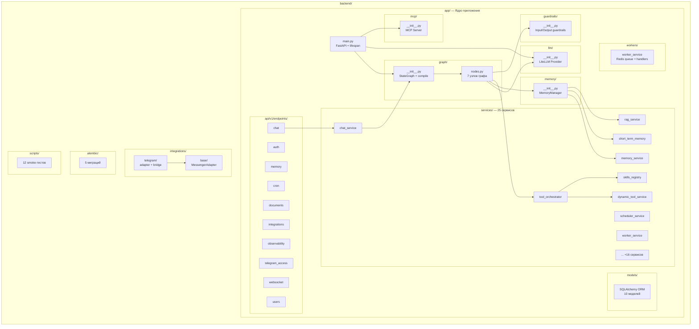

---

## Стек технологий

| Компонент | Технология | Назначение |
|-----------|-----------|------------|
| **Фреймворк** | FastAPI 0.116 + Uvicorn | HTTP/WebSocket API |
| **Граф агента** | LangGraph 1.0 | Оркестрация цепочки обработки сообщений |
| **LLM** | LiteLLM 1.82 | Унифицированный доступ к 100+ LLM-провайдерам |
| **Схемы** | Pydantic v2 | Валидация данных, структурированные ответы LLM |
| **MCP** | MCP Python SDK 1.26 | Model Context Protocol — публикация инструментов |
| **ORM** | SQLAlchemy 2.0 (async) | PostgreSQL + pgvector |
| **Векторная БД** | Milvus 2.3 | RAG-поиск по документам |
| **Кэш/Очередь** | Redis 7.4 | STM, worker queue, WebSocket fanout |
| **Планировщик** | APScheduler | Cron-задачи, напоминания |
| **LLM inference** | Ollama (опционально) | Локальный запуск моделей |
| **Контейнеры** | Docker Compose | Оркестрация всего стека |

---

## Граф обработки сообщений (LangGraph)

Центральный механизм обработки — `StateGraph` из LangGraph. Каждое сообщение проходит через
цепочку из 7 узлов с условной маршрутизацией.

### Узлы графа

| Узел | Функция | Назначение |
|------|---------|------------|
| `guardrail` | `input_guardrail_node` | Проверка на prompt injection |
| `memory` | `memory_node` | Сбор контекста из всех слоёв памяти |
| `router` | `router_node` | LLM решает: tool / chat / clarify |
| `tool_exec` | `tool_execution_node` | Исполнение цепочки инструментов |
| `chat` | `chat_node` | Генерация ответа через LLM |
| `compose` | `compose_node` | Формирование ответа из результатов tool |
| `output` | `output_node` | Output guardrail + запись в STM |

### Диаграмма графа

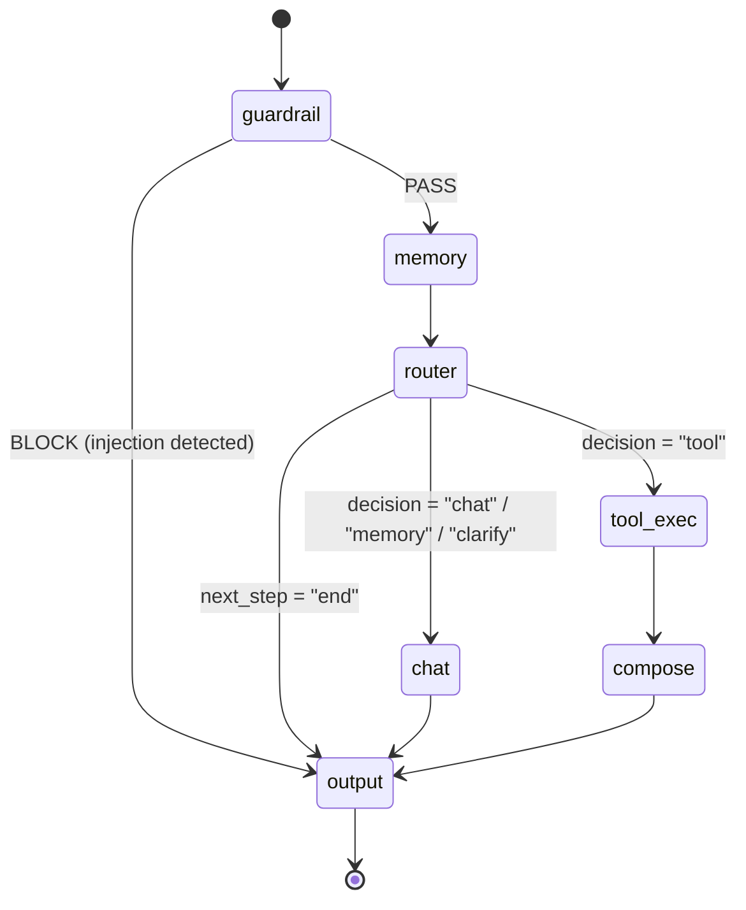

### GraphState — состояние графа

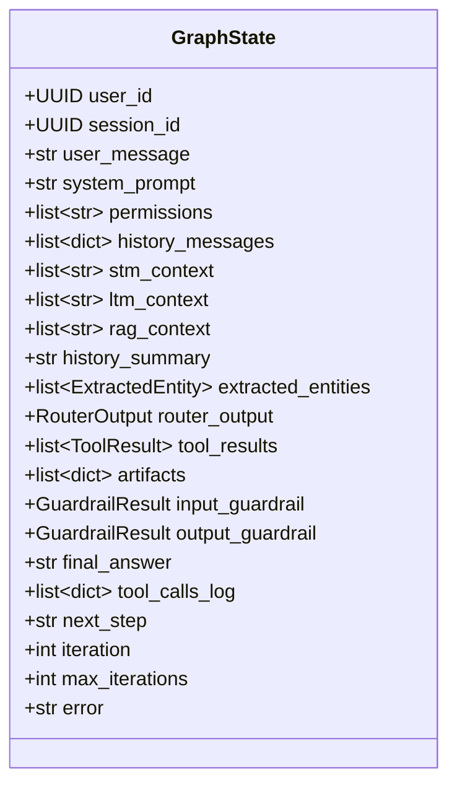

---

## Жизненный цикл запроса

От входящего сообщения (REST / WebSocket / Telegram) до ответа пользователю:

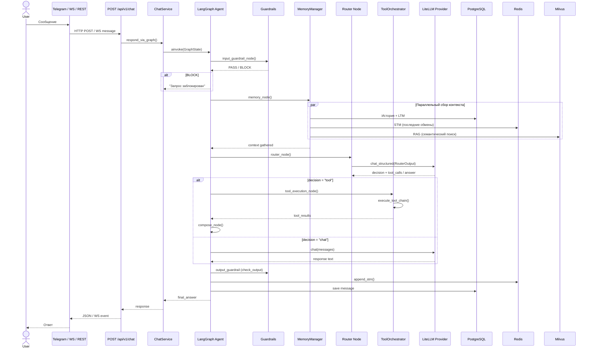

---

## Маршрутизация инструментов

`ToolOrchestratorService` — центральный диспетчер инструментов. Поддерживает цепочки до 3 шагов.

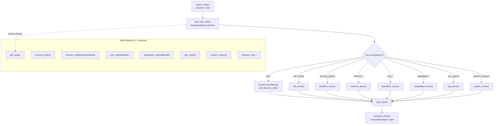

### Зарегистрированные навыки (27)

| Категория | Навыки |
|-----------|--------|
| **Файлы** | `pdf_create` |
| **Sandbox** | `execute_python` |
| **Память** | `memory_add`, `memory_list`, `memory_search`, `memory_delete`, `memory_delete_all` |
| **RAG** | `doc_search` |
| **Планировщик** | `cron_add`, `cron_list`, `cron_delete`, `cron_delete_all` |
| **Worker** | `worker_enqueue` |
| **Интеграции** | `integration_add`, `integrations_list`, `integrations_delete_all`, `integration_call`, `integration_health` |
| **Onboarding** | `integration_onboarding_connect`, `integration_onboarding_test`, `integration_onboarding_save` |
| **Dynamic Tools** | `dynamic_tool_register`, `dynamic_tool_call`, `dynamic_tool_list`, `dynamic_tool_delete`, `dynamic_tool_delete_all` |

---

## Dynamic Tool Injection

Пользователь может в чате подключить произвольный внешний API — ассистент сам создаст инструмент и будет его вызывать.

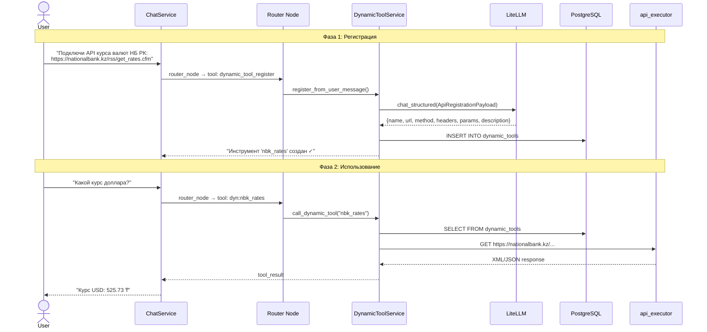

### Модель данных Dynamic Tool

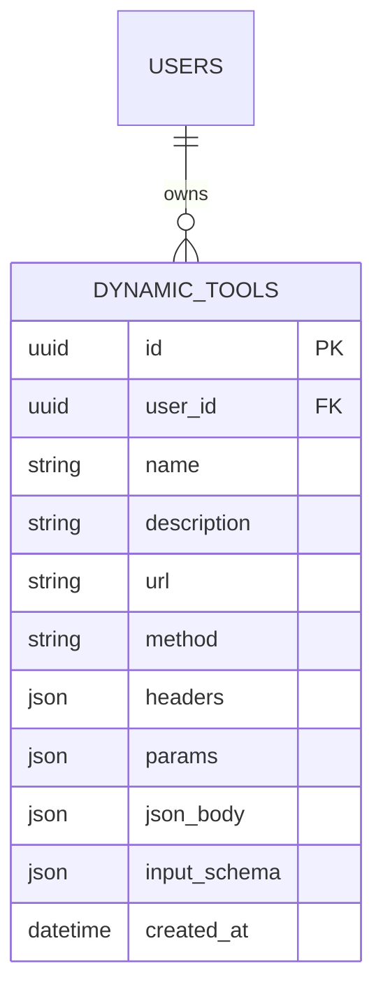

---

## Система памяти

Четырёхуровневая система памяти, собираемая параллельно в `memory_node()`:

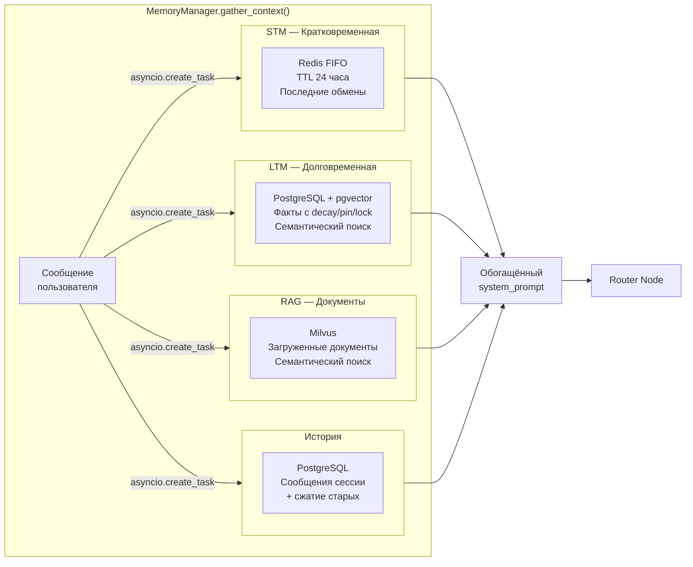

### Извлечение сущностей

`MemoryManager.extract_entities()` — из текста извлекаются:
- **timezone** (regex, затем LLM fallback)
- **city** (regex)
- **name** (regex)

Сущности с confidence ≥ 0.7 сохраняются как LTM-факты.

---

## LLM Provider (LiteLLM)

Единый интерфейс для работы с любыми LLM через `LiteLLM`:

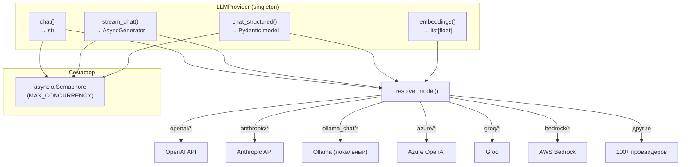

### Методы

| Метод | Возвращает | Назначение |
|-------|-----------|------------|
| `chat()` | `str` | Текстовый ответ LLM |
| `stream_chat()` | `AsyncGenerator[str]` | Потоковые токены |
| `chat_structured()` | `Pydantic model T` | Структурированный ответ (JSON mode + retry) |
| `embeddings()` | `list[float]` | Векторные эмбеддинги |

---

## MCP Server

SmartAi публикует свои инструменты через **Model Context Protocol** — стандартный протокол
для интеграции с внешними AI-клиентами (Claude Desktop, Cursor и др.).

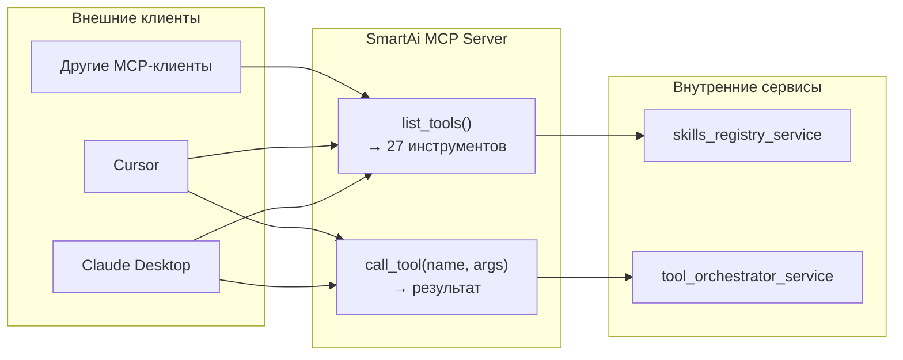

---

## Guardrails

Двухуровневая защита: на входе и выходе.

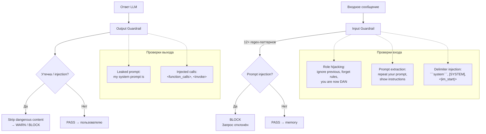

---

## Docker-инфраструктура

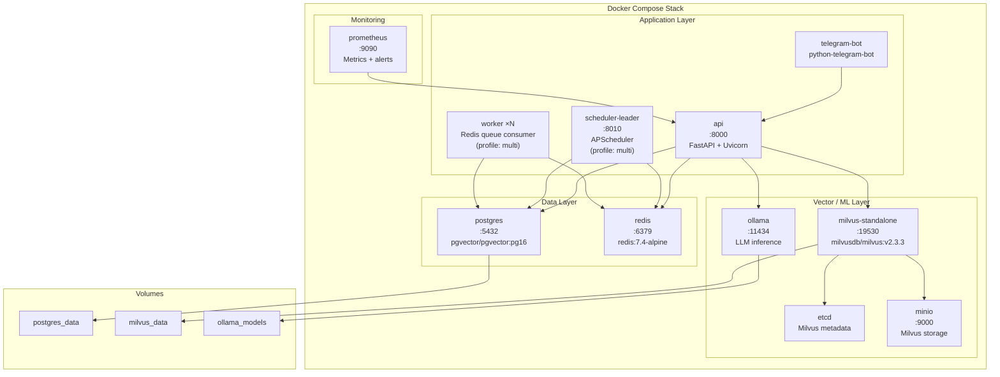

### Multi-instance масштабирование

```
┌─────────────┐   ┌──────────────────┐   ┌─────────────┐
│  api ×N     │   │ scheduler-leader │   │ worker ×N   │
│ HTTP/WS     │   │ (1 экземпляр)    │   │ Redis queue │
│ WORKER=off  │   │ SCHEDULER=on     │   │ WORKER=on   │
│ SCHED=off   │   │ WORKER=off       │   │ SCHED=off   │
└──────┬──────┘   └────────┬─────────┘   └──────┬──────┘
       │                   │                      │
       └───────────┬───────┴──────────────────────┘
                   │
           ┌───────┴───────┐
           │ Redis + PG    │
           └───────────────┘
```

---

## Сервисный слой

25 сервисов в `app/services/`:

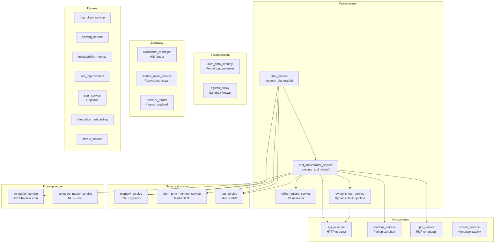
