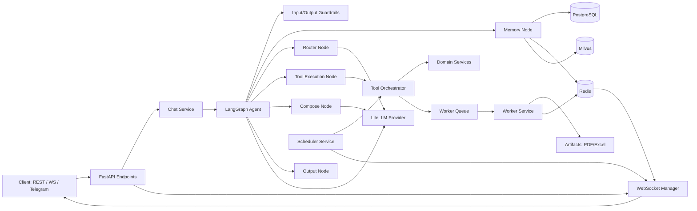
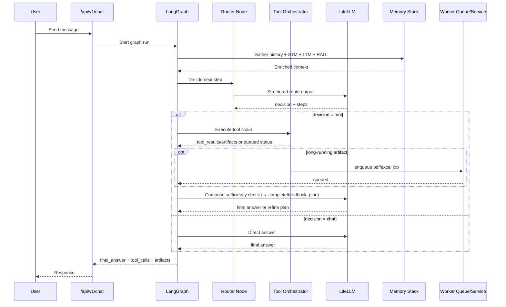

# SmartAi Backend - Project Structure and Logic Diagram

Этот документ дает быстрый обзор структуры проекта и логики работы основных подсистем.

## 1) Project Structure (High Level)

```text
backend/
  app/
    api/
      v1/
        endpoints/        # REST/WebSocket endpoints (chat, auth, cron, memory, docs, integrations)
    core/                 # Config, security, shared constants
    db/                   # DB base/session
    graph/                # LangGraph pipeline (nodes, routing, output postprocess)
    guardrails/           # Input/output safety checks
    llm/                  # LiteLLM provider wrapper
    mcp/                  # MCP server integration
    memory/               # Memory manager orchestration
    models/               # SQLAlchemy models
    schemas/              # Pydantic schemas
    services/             # Business services (chat, tools, scheduler, memory, integrations)
    workers/              # Background worker models/logic
    main.py               # App startup/lifespan wiring
  alembic/                # DB migrations
  integrations/           # External messenger adapters (e.g. Telegram)
  scripts/                # Smoke checks, test helpers, ops scripts
  docker-compose*.yml     # Local and multi-instance orchestration
  README.md               # Quick start
  ARCHITECTURE.md         # Detailed architecture
  RELEASE.md              # Release runbook
```

## 2) Logical Component Diagram



## 3) Main Request Flow (Chat)



## 4) Background and Reliability Paths

- Scheduler syncs/executes cron jobs and can trigger chat/tool actions.
- Worker handles heavy jobs (PDF/Excel) asynchronously with queue/retry semantics.
- Redis is used for worker result delivery and WebSocket fanout.
- Guardrails run before and after generation to reduce unsafe responses.
- Router/compose layers include fallback recovery when structured LLM output is malformed.

## 5) Key Files to Read Next

- README and quick run: [README.md](README.md)
- Detailed architecture: [ARCHITECTURE.md](ARCHITECTURE.md)
- Graph wiring: [app/graph/__init__.py](app/graph/__init__.py)
- Graph logic nodes: [app/graph/nodes.py](app/graph/nodes.py)
- Tool orchestration: [app/services/tool_orchestrator_service.py](app/services/tool_orchestrator_service.py)
- Chat orchestration: [app/services/chat_service.py](app/services/chat_service.py)
- Scheduler: [app/services/scheduler_service.py](app/services/scheduler_service.py)
- Worker: [app/workers/worker_service.py](app/workers/worker_service.py)

## 6) Ownership Map (Team View)

Use this section as a lightweight ownership guide for incidents and feature changes.

| Area | Main responsibility | Typical files |
|------|---------------------|---------------|
| API contract and transport | HTTP/WS endpoints, response shape, auth integration | `app/api/v1/endpoints/*`, `app/main.py` |
| Conversation orchestration | Graph state flow, routing decisions, compose/output behavior | `app/graph/__init__.py`, `app/graph/nodes.py`, `app/graph/routing_policy.py` |
| Tool execution | Tool planning/execution, argument validation, chain context | `app/services/tool_orchestrator_service.py`, `app/services/skills_registry_service.py` |
| LLM platform | Provider stability, model settings, structured output behavior | `app/llm/*`, `app/core/config.py` |
| Memory and context | STM/LTM/RAG retrieval and writes | `app/memory/*`, `app/services/memory_service.py`, `app/services/rag_service.py` |
| Scheduler and reminders | Cron sync/execute lifecycle, one-time jobs, proactive jobs | `app/services/scheduler_service.py`, `app/api/v1/endpoints/cron.py` |
| Background artifacts | PDF/Excel async jobs, queue/retry/recovery, delivery payloads | `app/workers/worker_service.py`, `app/services/pdf_service.py`, `app/services/delivery_format_service.py` |
| Messaging integrations | Telegram bridge and adapter behavior | `integrations/messengers/*`, `scripts/smoke_telegram_bridge.py` |
| Runtime operations | Compose profiles, migrations, pre-release checks | `docker-compose*.yml`, `alembic/*`, `RELEASE.md`, `scripts/smoke_all.py` |

## 7) On-Call Debug Checklist

Use this when a user says "assistant is not working", "PDF not generated", "reminders duplicate", etc.

### A. Quick health triage (1-2 min)

1. Check API process startup lines and health endpoint.
2. Check DB/Redis reachability errors in logs.
3. Check LLM provider errors (`structured parse failed`, `500 Internal Server Error`, model not found).
4. Confirm scheduler/worker enabled flags from runtime config.

### B. Request-path triage (chat)

1. Find `chat endpoint dev trace: request_start` and track same `session_id`.
2. Confirm sequence appears: `memory_gather -> router -> tool_exec/chat -> compose -> response_ready`.
3. If router fails on structured parse:
  - Check whether salvage path is used (`router_fallback_salvaged`).
4. If tool executes but fails:
  - Inspect `tool_orchestrator step_error` and the exact arguments.

### C. PDF-specific triage

1. Check router step selection:
  - Is `pdf_create` chosen intentionally?
  - Is `content` empty or unresolved placeholder (`$prev.body` with no previous step)?
2. Check worker enqueue:
  - `worker task enqueued` exists?
  - queue key and priority are correct?
3. Check worker processing:
  - handler `_handle_pdf_create` success/failure.
4. Check delivery:
  - `worker_result` pushed and emitted to WS/Telegram.

### D. Reminder/scheduler triage

1. Confirm one-time cron deactivates after execution.
2. Ensure periodic sync does not reload inactive once jobs.
3. Verify duplicate-execution lock behavior for current minute bucket.

### E. High-value smoke commands

Run focused smokes before broad `smoke_all`:

1. `python -m scripts.smoke_router_tool_export_salvage`
2. `python -m scripts.smoke_export_followup_guard`
3. `python -m scripts.smoke_pdf_prev_placeholder_fallback`
4. `python -m scripts.smoke_cron_once_finalize`

## 8) Symptom -> Probable Cause -> First Fix

| Symptom | Probable cause | First fix |
|--------|-----------------|-----------|
| Router goes to chat despite export intent | Structured RouterOutput parse failed and no salvage route | Verify salvage branch logs and model output; reduce oversized tool args in prompt |
| `pdf_create requires non-empty content` | Unresolved placeholder or empty content from planner step | Ensure fallback export content injection path works; check `_augment_step_arguments` |
| Duplicate reminder notifications | Once-job row remains active and gets re-synced | Check once finalization and DB `is_active` updates |
| Final answer generic/unhelpful | Compose structured parse failed or insufficient context | Inspect compose logs and feedback plan path |
| User sees queue message but no file | Worker failed or delivery fanout issue | Check worker task status, result payload, WS/Telegram delivery |
